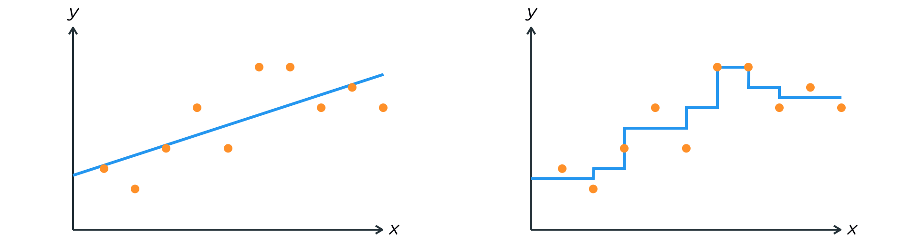

```{r setup, include=FALSE}
knitr::opts_chunk$set(echo = TRUE)
```


1) Provide a sketch of typical (squared) bias, variance, training error, test error, and  irreducible error curves, on a single plot, as we go from less flexible statistical learning methods
towards more flexible approaches. The x-axis should represent
the amount of flexibility in the method, and the y-axis should
represent the values for each curve. There should be five curves. Make sure to label each one.

  b) Explain why each of the five curves has the shape displayed in part (a)
  
  
2) Consider the following model fits.



Which model is more flexible? **Why**? Discuss how interpretability is related to the flexibility.

3) Group the following methods based on their interpretability and flexibility.

Methods: Bagging, Lasso, Boosting, Subset selection, LS, Regression Tree, Classification Tree.

| Less flexible, more interpretable | Moderately flexible and interpretable | More flexible, less interpretable |
| -------------- | --------------- | --------------- |
|     |    |     |
|     |     |     |
|     |    |     |
|     |     |     |
| -------------- | --------------- | --------------- |


4) Consider the relationship between a response variable $Y$ and an explanatory variable $x$ and the following statements. Answer **TRUE** or **FALSE.** If you choose that the statement is **TRUE**, no explanation is needed. If you choose that the statement is **FALSE**, EXPLAIN WHY. 

$$Y=f(x)+\epsilon$$

  i) This is an unsupervised learning problem.
  
  ii) $f(x)$ captures the systematic part of $Y$.
  
  iii) This is a regression problem only if $x$ is quantitative.
  
  iv) For a parametric method, assuming a form for $f$ with more free parameters generally leads to a more flexible fit.

  v) A disadvantage to using a parametric method rather than a non-parametric one is that many observations are needed to estimate f decently.


<!--
I is false because an unsupervised learning problem does not have a response variable.

III is false because a regression problem involves a quantitative response variable, which is implied by the given relationship. Explanatory variables are free to be quantitative or categorical, but they don't dictate whether the problem belongs to regression or classification.

V is false because the stated disadvantage is for non-parametric methods relative to parametric ones. One disadvantage of parametric methods is that f's chosen functional form might be significantly different from the true f.

Therefore, only II and IV are true.
-->