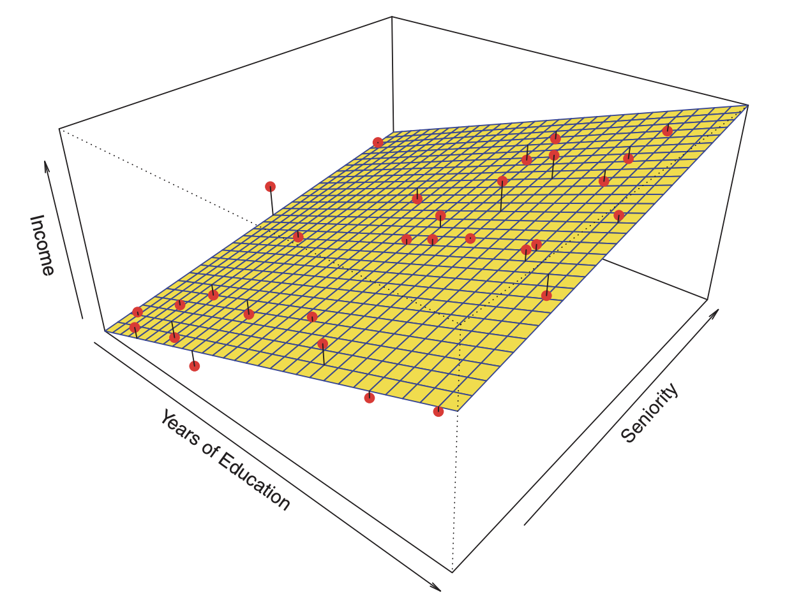
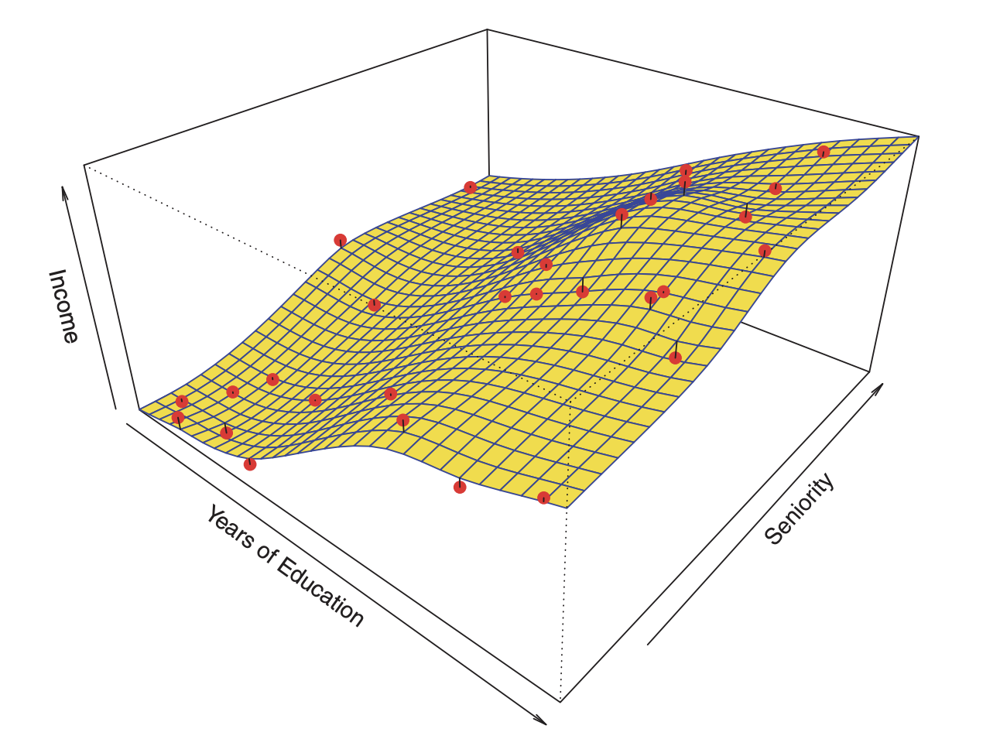
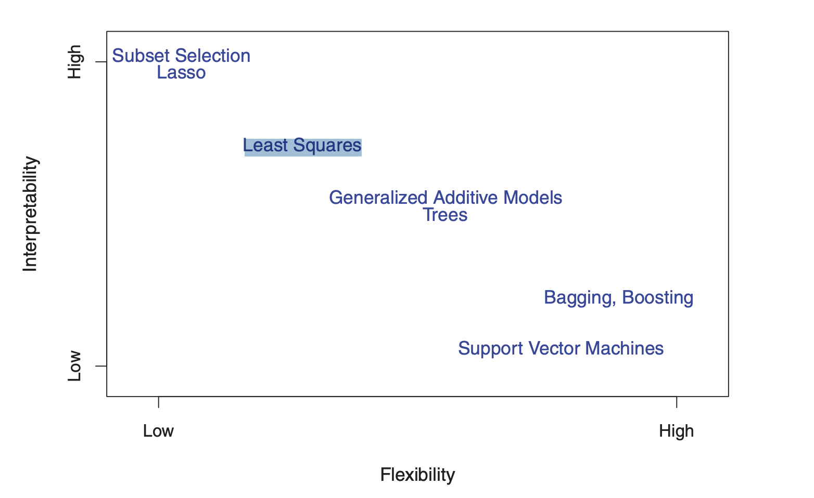
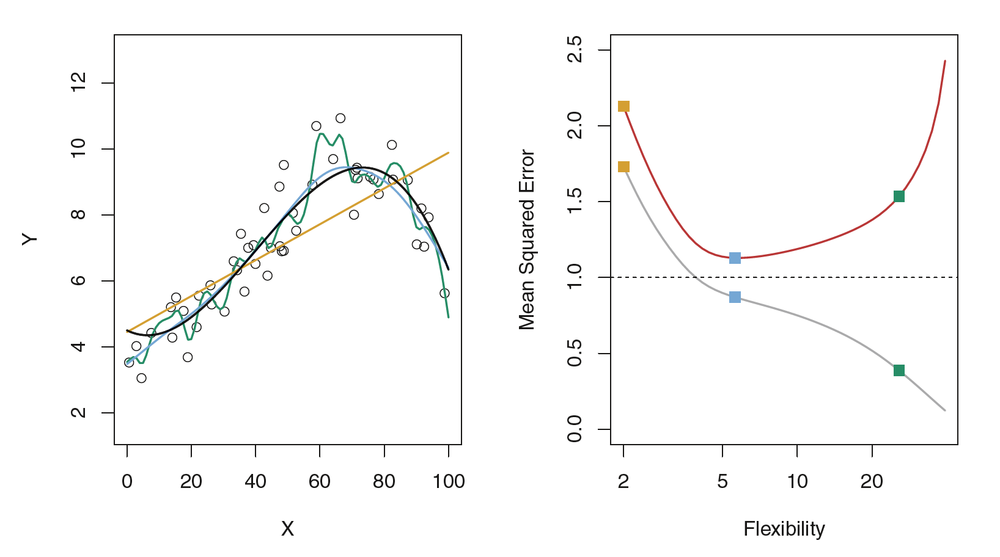
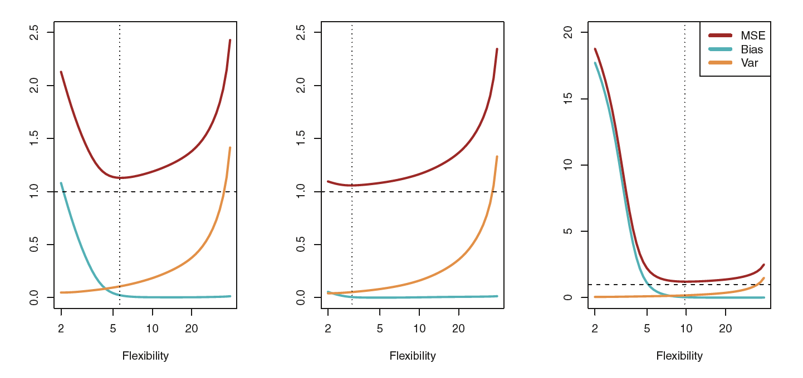

```{r setup, include=FALSE}
knitr::opts_chunk$set(echo = TRUE)
library(ggplot2)
library(ISLR)
```

# Statistical learning?

Statistical learning is the use of past data to find how a variable depends on other variables, or how data can be summarized or represented. 

For example, an insurance company may want to estimate the claim costs (_________) for an insured
based on various features (_________) of the insured-age, sex, income, credit rating, past claim experience, and other similar features. If ____ is claim costs and ____ are the various features, we would like to find the function ___ for which


&nbsp;

There is no perfect $f$, so we have to allow for error. Let ____ the error. Then we want a function $f$ for which

$$Y=f(X_1,X_1,\dots,X_p)$$
  
Where, 

  * $\epsilon$ is independent of $X$
  
  * $E(\epsilon) = 0$ 
  
We would like to pick the $f$ that makes the error $\epsilon$ as small as possible. The remaining error is the ________ error.

  * The input variables $X_i$ are called ________ variables, ________ variables, ________, or ________. (Usually, the term "features" is only used if $X_i$ is a discrete random variable with a finite number of possible values.) 

  * The output variable $Y$ is called the ________ variable or the ________.
  
  * Sample size is usually denoted by $n$
  
  * The number of predictors is denoted by ____
  

```{example}
Example:
  Suppose that we are statistical consultants hired by a client to provide advice on 
how to improve sales of a particular product. The Advertising data set consists of 
the sales of that product in 200 different markets, along with advertising budgets 
for the product in each of those markets for three different media: TV, radio, and 
newspaper.

  1) What is the response variable in this senario?
  
  2) What is the sample size?
  
  3) How many predictor variables are there? (what is $p$?)

  4) List the predictor variables
```

It is not possible for our client to directly increase
sales of the product. On the other hand, they can control the advertising
expenditure in each of the three media. Therefore, if we determine that
there is an association between advertising and sales, then we can instruct
our client to adjust advertising budgets, thereby indirectly increasing sales.
In other words, our goal is to develop an accurate model that can be used
to predict sales on the basis of the three media budgets.

## Why estimate $f$?

There are two main reasons that we may wish to estimate f: 

  1) 
  
  2) 
  

### Prediction

In many situations, a set of inputs ___ are readily available, but the output
___ cannot be easily obtained. In this setting, since the error term averages
to zero, we can predict $Y$ using 

&nbsp; 

where ___ represents our estimate for ___ , and ___ represents the resulting prediction
for ___.

The accuracy of $\hat{Y}$ as a prediction for $Y$ depends on two quantities

  1) 
  
&nbsp; 

  2) 
  
&nbsp; 


**Let's look at this mathematically**

$$E(Y-\hat{Y})^2 = E[f(X) + \epsilon - \hat{f}(X)]^2$$
&nbsp; 

The focus of this class is on techniques for estimating $f$ with the aim of
minimizing the reducible error.

### Inference

Here we want to understand
the relationship between $X$ and $Y$ , or more specifically, to understand how
$Y$ changes as a function of $X_1, . . .,X_p.$

In this case, we are
interested in answering the following questions:

  1) 
  &nbsp;
  
  2) 
  &nbsp;
  
  3)
  &nbsp;
  
```{example}
Example:
  
Consider a company that is interested in conducting a
direct-marketing campaign. The goal is to identify individuals who will
respond positively to a mailing, based on observations of demographic variables
measured on each individual. In this case, the demographic variables
serve as predictors, and response to the marketing campaign (either positive
or negative) serves as the outcome. 

  a) Is this a prediction problem or an inference problem?
  
  b) Explain why.
```

<!--
This is an example of modeling for prediction.

The company is not interested in obtaining a deep understanding of the relationships between each individual predictor and the response; instead, the company simply wants an accurate model to predict the response using the predictors. 
-->

```{example}
Example:
  
Now consider the above company is interested in answering questions such as:
– Which media contribute to sales?
– Which media generate the biggest boost in sales? or
– How much increase in sales is associated with a given increase in TV
advertising?
  
  a) Is this a prediction problem or an inference problem?
  
  b) Explain why.
  
```

```{example}
Example:
  
Consider modeling the brand of a product that a customer might purchase based on
variables such as price, store location, discount levels, competition price,
and so forth. In this situation one might really be most interested in how
each of the individual variables affects the probability of purchase. For
instance, what effect will changing the price of a product have on sales? 
  
  a) Is this a prediction problem or an inference problem?
  
  b) Explain why.

```

## How Do We Estimate $f$?

There are many linear and non-linear approaches for estimating $f$. Here we only discuss an overview of linear approaches.

  * We will always assume that we have observed a set of $n$ different
data points.
  * These observations are called the _________ because we will use these 
observations to train, or teach, our method how to estimate $f$.
  * Let __ represent the value of the ___ predictor, or input, for observation __, where
$i = 1, 2,...,n$ and $j = 1, 2,...,p$.
  * Let __ represent the response variable for the __ observation.
  

Example:
  
Consider the Wage data set.

  1) What is $n$?
  2) How many predictors are there?
  3) What is $x_{2,5}$


```{r include=FALSE}
library(ISLR)
data(Wage)
head(Wage)
dim(Wage)
#View(Wage)
```


Our goal is to apply a statistical learning method to the training data
in order to estimate the unknown function $f$. In other words, we want to
find a function $\hat{f}$ such that $Y \approx \hat{f}(X)$ for any observation $(X, Y )$. Broadly
speaking, most statistical learning methods for this task can be characterized as either 

  * parametric or 
  * non-parametric. 

### Parametric Methods

Parametric methods involve a two-step model-based approach.

  1) First, we visually inspect the functional form, or shape,
of $f$. For example, one very simple functional form is that $f$ is linear in
$X$:

&nbsp;

  2) After a model has been selected, we need a procedure that uses the
training data to fit or train the model. In the case of the linear model, we need to estimate the parameters ______________ That is, we want to find values of these parameters such that

$$\hat{Y} = \hat{\beta_0} + \hat{\beta_1}X_1 + \dots + \hat{\beta_p}X_p$$

&nbsp;

The most common approach to fitting the model is referred to as _______________.

The model-based approach just described is referred to as parametric; it reduces the problem of estimating $f$ down to one of estimating a set of parameters ________________.

#### flexibility and overfitting

  *  The model we choose will usually not match the true
unknown form of $f$.
  *  If the chosen model is too far from the true $f$, then
our estimate will be poor.
  *  We can try to address this problem by choosing flexible models that can fit many different possible functional forms flexible for $f$.
  * But in general, fitting a more flexible model requires estimating a
greater number of parameters.
  * These more complex models can lead to a phenomenon known as overfitting the data.
  
  Example: 
  
  
  
  
  
  
  
   


### Non-parametric Methods

Non-parametric methods do not make explicit assumptions about the functional form of f. Instead they seek an estimate of f that gets as close to the data points as possible without being too rough or wiggly. 

  **Advantage**: By avoiding the assumption of a particular functional form for $f$, they have the potential to accurately fit a wider range of possible shapes for $f$.
  
  **Disadvantage**: since they do not reduce the problem of estimating f to a small number of parameters, a very large number of observations (far more than is typically needed for a parametric approach) is required in order to obtain an accurate estimate for $f$.


##  The Trade-Off Between Prediction Accuracy and Model Interpretability


   

*why would we ever choose to use a more restrictive method instead of a very flexible approach?* If we are mainly interested in __________, then restrictive models are much more interpretable. For instance, when inference is the goal, the linear model may be a good choice since it will be quite easy to understand the relationship between $Y$ and $X_1, X_2,...,X_p$. For example Least
squares linear regression is relatively inflexible but is quite interpretable (Ch 3). 

In some settings, however, we are only interested in __________, and the interpretability of the predictive model is simply not of interest.  In this setting, we might expect that it
will be best to use the most flexible model available. Surprisingly, this is not always the case! We will often obtain more accurate predictions using a less flexible method. 

Finally, fully non-linear methods such as __________, __________, and __________, are highly flexible approaches that are harder to interpret.


## Supervised Versus Unsupervised Learning


| Supervised Learning          | Unsupervised Learning    |
| -----------------------------|-------------------------:|
| There is an associated response measurement $y_i$. | There is NO associated response measurement $y_i$. |
| Fit a model that relates the response to the predictors with the aim of accurately predicting the response for future observations (prediction) or better understanding the relationship between the response and the predictors (inference). | Understand the relationships between the variables or between the observations. |
| Examples: linear regression, logistic regression, GAM, boosting, and support vector machines |  One statistical learning tool that we may use in this setting is cluster analysis, or clustering. |


## Regression Versus Classification Problems

Recall: Variables can be characterized as either ____________ or _____________ (also  known as ___________). 

___________ variables take on ___________ values. Examples: 

In contrast, qualitative variables take on values in one of $K$ different classes, or categories. Examples: 


| Regression Problems          | Classification Problems  |
| -----------------------------|-------------------------:|
| Problems with a ___________ response ($y$) | Problems with a ___________ response ($y$) |
| Example: ___________ linear regression is used with a quantitative response | Example:  ___________ regression is typically used with a qualitative (two-class, or binary) response. |

Note: $K$-nearest neighbors and boosting, can be used in the case of either quantitative or qualitative responses. We tend to select statistical learning methods on the basis of whether the _________ is quantitative or qualitative; i.e. we might use linear regression when quantitative and logistic regression when qualitative. However, whether the __________ are qualitative or quantitative is generally considered less important.


## Assessing Model Accuracy

**Question:** Why is it necessary to introduce so many different statistical learning approaches, rather than just a single best method?

**Answer:** 
&nbsp;

Selecting the ______________ can be one of the most challenging parts of performing statistical learning in practice.


### Measuring the Quality of Fit

In order to evaluate the performance of a statistical learning method on
a given data set, we need some way to measure how well its ______________
actually _______ the ______________. In the regression setting, the most commonly-used measure is the ______________ (MSE), given by

$$MSE = \dfrac{1}{n}\sum_{i=1}^{n}[y_i-\hat{f}(x_i)]^2 $$

&nbsp;


where $\hat{f}(x_i)$ is the prediction that $\hat{f}$ gives for the $i^{th}$ observation. $y_i$ is the $i^{th}$ observed value.

  * The MSE will be _______ if the predicted responses are very close to the true responses
  * The MSE will be _______ if the predicted and true responses differ substantially.
  * The MSE here is computed using the _______ data that was used to fit the model and so should more accurately be referred to as the **training MSE**.
  * But in general, we do not really care how well the method works on the _______ data. Rather, we are interested in the accuracy of the predictions that we obtain when we apply our method to previously _______ _______ data.
  
*Let's look at the last point above mathematically:*

suppose that we fit our statistical learning method on our training observations

&nbsp;

and we obtain the estimate _______

We can then compute

&nbsp;

If these are approximately equal to 

&nbsp;

then the training MSE is _______.

However, we are really not interested in whether _______; instead, we want to know whether _______ is approximately equal to _______, where (____, ____) is a previously unseen test observation not used to train the statistical learning method.

We want to choose the method that gives the ______________, as opposed to the lowest ______________. In other words, if we had a large number of _______ observations, we could compute

&nbsp;

the average squared prediction error for these test observations $(x_0, y_0)$.


*How can we go about trying to select a method that minimizes the test MSE?*  In some settings, we may have a test ______________ that is,
we may have access to a set of observations that were ______________ to train
the statistical learning method. We can then simply evaluate MSE on the
test observations, and select the learning method for which the test MSE is ______________.

*But what if no test observations are available?* In that case, one
might imagine simply selecting a statistical learning method that minimizes
the training MSE.


### Undestanding training and test MSEs


This figure illustrates a phenomenon on a simple example. 

**In the left hand panel:**

  * We have generated observations with the true $f$ given by the black curve. 

  * The orange, blue and green curves illustrate three possible ___________ obtained using methods with increasing levels of ___________. 
  
  * The orange line is the ______________________, which is relatively ___________. 
  
  * The blue and green curves were produced using smoothing splines (a more complex model) with different levels of smoothness.
  
  * The level of ___________ ___________ as the curves fit the observed data more ___________.  

**On to the right-hand panel:**

  * The *grey* curve displays the average ___________ ______ as a function of ___________
  
  * The orange, blue and green squares indicate the MSEs associated with the corresponding curves in the left hand panel.
  
  * The ___________ MSE ___________ monotonically as ___________ increases.
  
  * The test MSE is displayed using the red curve in the right-hand panel.
  
  * As with the training MSE, the ___________ MSE initially ___________ as the level of ___________ increases.
  
  * However, at some point the test MSE levels off and then starts to increase again.

In summary, as the flexibility of the statistical learning method increases, we observe a monotone decrease in the training MSE and a U-shape in the test MSE. This is a fundamental property of statistical learning that holds regardless of the particular data set at hand
and regardless of the statistical method being used.

  * When a given method yields a small ___________ MSE but a large ___________ MSE, we are
said to be ___________ the data.

  * Note that regardless of whether or not overfitting has occurred, we almost always expect the training MSE to be smaller than the test MSE.
  
  

### The Bias-Variance Trade-Off

The U-shape observed in the test MSE curves in the previous Figures turns out to be the result of ___________ competing properties of statistical learning methods. Though the mathematical proof is beyond the scope of this class, it is possible to show that the expected test MSE, for a given value $x_0$, can always be decomposed into the sum of three fundamental quantities: 

    *
    *
    *
  
$$\text{Var}(\epsilon)$$


Here the notation ___________ defines the expected test MSE.

This equation tells us that in order to minimize the expected test error,
we need to select a statistical learning method that simultaneously achieves
___________ and ___________.


Note that variance is inherently a ___________ quantity, and squared bias is also ___________.

Therefore, we see that the expected test MSE can never lie below $Var(\epsilon)$, the irreducible error.

*What do we mean by the variance and bias of a statistical learning
method?* 

  * Variance refers to the amount by which ___________ would change if we estimated it using a ______________________.
    
  * But ideally the estimate for $f$ ___________ vary too much between training sets. 
    
  * In general, ___________ statistical methods have ___________ variance.
    
  * On the other hand, bias refers to the error that is introduced by approximating a real-life problem, which may be extremely complicated, by a much simpler model. For example, linear regression assumes that there is a linear relationship between $Y$ and $X_1,X_2, . . . , X_p$. It is unlikely that any real-life problem truly has such a simple linear relationship, and so performing linear regression will undoubtedly result in some bias in the estimate of $f$. In other words, linear regression results in ___________.
    

Let's try to visualize the bias and the variance a little bit more... 
  
  
  

  * As a general rule, as we use ___________ methods, the variance will ___________ and the bias will ___________.
    
  * The relative rate of change of these two quantities (____ and _____) determines whether the ___________ increases or decreases.
  
  * As we increase the flexibility of a class of methods, the bias tends to initially decrease faster than the variance increases.
  
  * Consequently, the expected test MSE ___________.
  
  * However, at some point increasing flexibility has ___________
impact on the ___________ but starts to significantly increase the ___________.

  * When this happens the test MSE ___________.
  
  * In the graph above, the horizontal dashed line represents $Var(\epsilon)$, the irreducible error. Finally, the red curve, corresponding to the test set MSE, is the sum of these three quantities.
  
  * The relationship between bias, variance, and test set MSE given in the Equation above and displayed in Figure is referred to as the ___________.
  
  
Example: [Bias variance trade off demonstration](BiasVariance.html). 


## The Classification Setting

Now our $y$ is ___________.

Suppose that we seek to estimate $f$ on the basis of training observations
${(x_1, y_1), . . . , (x_n, y_n)}$, where now $y_1, . . . , y_n$ are ___________.

The
most common approach for quantifying the accuracy of our estimate $\hat{f}$ is
the training error rate, the proportion of mistakes that are made if we apply our estimate $\hat{f}$  to the training observations:

&nbsp;


  * Here _____ is the predicted class label for the ith observation using _____.

  * _____ is an indicator variable that equals __ if _____ and _____ if _______.


  * If ___________ then the ith observation was classified ___________ by our
classification method; otherwise it was ___________.

  * Hence the above equation computes the fraction of incorrect classifications. This equation refer to as the ___________ because it is computed based on the data that was used to train our classifier.
  
  
  * The ___________ error rate associated with a set of ___________ observations of the form $(x_0, y_0)$ is given by

&nbsp;

  * where ___ is the predicted class label that results from applying the classifier
to the test observation with predictor $x_0$. A good classifier is one for which
the test error is ___________.


  
### Classification methods

#### K-Nearest Neighbors


Example: 


  a) Let $K = 3$. Find the probability that red dot belongs to Class B (purple). That is find
     $$P(Y = purple | X = x_o) = \frac{1}{K}\sum (Y = purple)$$
  b) Let $K = 6$. Find the probability that red dot belongs to Class A (yellow).
  

In general given a positive integer $K$ and a test observation $x_0$, the KNN classifier first identifies the neighbors
$K$ points in the training data that are closest to $x_0$, represented by $N_0$.
It then estimates the conditional probability for class $j$ as the fraction of
points in $N_0$ whose response values equal $j$:


