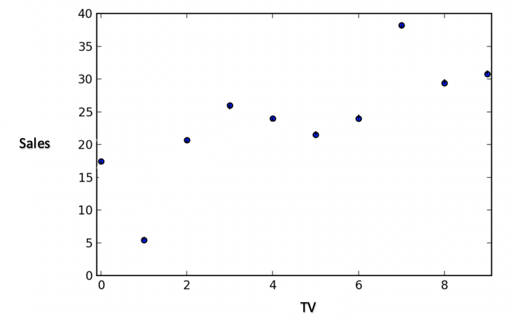
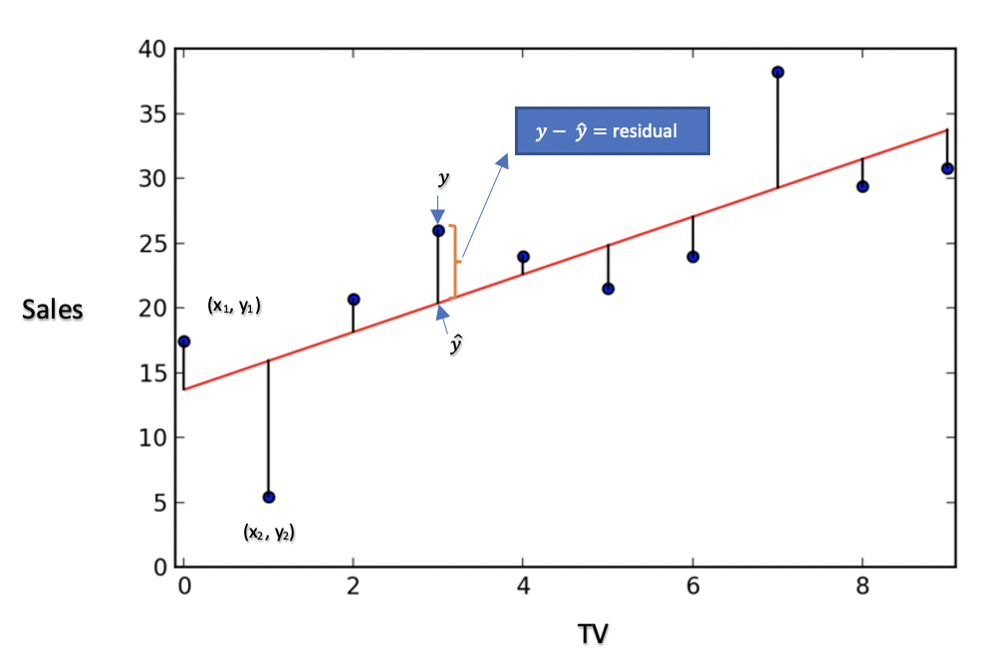
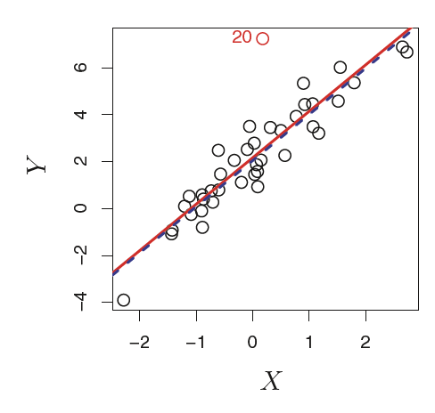
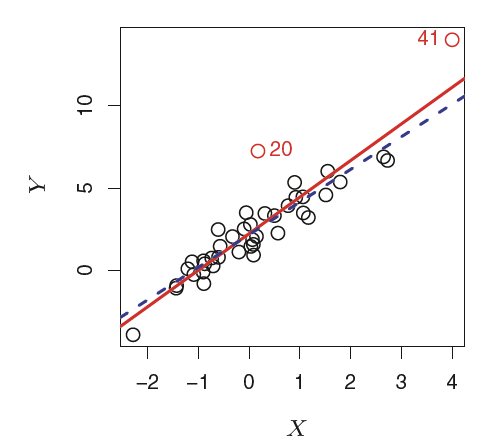

```{r setup, include=FALSE}
knitr::opts_chunk$set(echo = TRUE)
```


This chapter is about linear regression, a very simple approach for
supervised learning. Linear regression is 
a useful and widely used statistical learning method.

We use linear regression for predicting a _____________ response. 


# Simple Linear Regression

A very straightforward approach for predicting a _____________ response $Y$ on the basis of a _____________.

It assumes that there is approximately a linear
relationship between $X$ and $Y$ . Mathematically, we can write this linear
relationship as
 
&nbsp;

We will sometimes describe this relationship by saying that we are *regressing* $Y$ on $X$ (or $Y$ onto $X$).

**Example 1:**

Recall the Advertising data from Chapter 2. In this data, sales
(in thousands of units) for a particular product and advertising
budgets (in thousands of dollars) for TV, radio, and newspaper media are recorded.

```{r}
AdvertisingData <- read.csv("https://raw.githubusercontent.com/nguyen-toan/ISLR/master/dataset/Advertising.csv", header = TRUE, sep = ",")
AdvertisingData <- AdvertisingData[,-1]
head(AdvertisingData)
```
Let $X$ represents TV advertising and $Y$ represent sales. Write the model for regressing sales onto TV:

&nbsp;


  * ____ and _____ are two unknown constants that represent the ____ and ____ terms in the linear model.
  
  * Together, ____ and ____ are known as the model ____ or ____.
  
  * Once we have used our training data to produce estimates (how?) ____ and ____ for the model coefficients, we can predict future sales on the basis of a particular value of TV advertising by computing
  
  &nbsp;

where ____indicates a prediction of $Y$ on the basis of $X = x$. Here we use a
hat symbol, to denote the estimated value for an unknown parameter
or coefficient, or to denote the predicted value of the response.
  
## Estimating the Coefficients

Note: These scatter plots here are NOT the actual ones from Advertising data. 



What is the line of best fit? _____________________



  * $y =$ Observed value
  * $\hat{y} =$ Predicted value
  * $e = y - \hat{y} =$ residual
  
We get the LS line (estimates for the model coefficients) by minimizing the sum of squares of residuals (RSS)

  $$RSS = (y_1-\hat{y_1})^2+ (y_2-\hat{y_2})^2 +\dots + (y_n-\hat{y_n})^2 = 
  \sum_{i=1}^n(y_i-\hat{y_i})^2$$
  OR
  
  $$RSS = e_1^2+ e_2^2 +\dots + e_n^2 = 
  \sum_{i=1}^ne_i^2$$
  
  OR
  
  $$RSS = (y_1-(\beta_0+\beta_1x_1))^2+ (y_2-(\beta_0+\beta_1x_2))^2 +\dots + (y_n-(\beta_0+\beta_1x_n))^2 = 
  \sum_{i=1}^n(y_i-(\beta_0+\beta_1x_i))^2$$
  
Note: How do we minimize RSS? Derivatives are used to minimize RSS (outside the scope of our class). 

After minimizing RSS we get our estimates $\hat\beta_0$ and $\hat\beta_1$ for the model coefficients:

$$\hat\beta_1 = \frac{\sum_{i=1}^n(x_i-\bar{x})(y_i-\bar{y})}{\sum_{i=1}^n(x_i-\bar{x})^2} = r\times \frac{s_y}{s_x}$$

Where $r =$ Correlation coefficient, $s_y =$ the standard deviation of $y$ variable and $s_x =$ the standard deviation of $x$ variable 

$$\hat\beta_0 = \bar{y} - \hat\beta_1\bar{x}$$

The standard errors associated with $\hat{\beta_0}$ and $\hat{\beta_1}$

$$SE(\hat{\beta_0}) = \sqrt\frac{\sigma^2}{\sum_{i=1}^n(x_i-\bar{x})^2}$$

$$SE(\hat{\beta_1}) = \sqrt{\sigma^2 \left[\frac{1}{n}+\frac{\bar{x}^2}{\sum_{i=1}^n(x_i-\bar{x})^2}\right]}$$

In general, $\sigma^2$ is not known, but can be estimated from the data. The estimate of $\sigma$ is known as the residual stndard error (RSE), and is given by the formula


$$RSE = \sqrt\frac{RSS}{n-2}$$


**Example 2:**

```{r include=FALSE}
meanX <- mean(AdvertisingData$TV)
meanY <- mean(AdvertisingData$Sales)
r <- cor(AdvertisingData$TV, AdvertisingData$Sales)
sdX <- sd(AdvertisingData$TV)
sdY <- sd(AdvertisingData$Sales)
r*sdY/sdX

```

  a) From Advertising data it is found that:

  * The average cost for TV advertising is `r meanX`  
  * The standard deviation of cost for TV advertising is `r sdX` 
  * The average sales is `r meanY`  
  * The standard deviation of sales `r sdY`
  * Correlation coefficient between the cost for TV advertising and sales is `r r`

Find the LS estimates for model coefficients ($\hat{\beta_0}$, $\hat{\beta_1}$) when regressing sales onto TV.

&nbsp;

  b) Use the `lm()` function to find the LS estimates for model coefficients ($\hat{\beta_0}$, $\hat{\beta_1}$) when regressing sales onto TV. Compare your answers with a) 
  
  &nbsp;
  
```{r include=FALSE}
str(AdvertisingData)
head(AdvertisingData)
AdvertisingModel <- lm(Sales ~ TV, data = AdvertisingData)
summary(AdvertisingModel)
```
  
  c) State your final simple linear regression model
  
  &nbsp;
  
  d) Predict the sales for a TV budgets of $20,000, $30,000 and $50,000

```{r include=FALSE}
newx <- data.frame(TV = c(20, 30, 50))

predicted_sales <- predict(AdvertisingModel, newx)
predicted_sales
```
  
  
  
  d) Now that we have the model, we can find RSE. Find RSE without using the function `lm()`.
  
```{r include=FALSE}
y <- AdvertisingData$Sales
x <- data.frame(TV = AdvertisingData$TV)
yhat <- predict(AdvertisingModel, x)

resids <- y - yhat
  
library(DT)

tab <- datatable(data.frame(y, yhat, resids))
tab

RSS <- sum(resids^2)

RSE <- sqrt(RSS/(length(y)-2))
RSE
```
  

   &nbsp;
   
  e) Estimate the $SE(\hat\beta_1)$ without using the function `lm()`.
  
```{r include=FALSE}
denominator <- var(AdvertisingData$TV)*((length(y)-1))
SEbeta1 <- sqrt(RSE^2/denominator)
SEbeta1
```

  &nbsp;
  
## Interpreating regression coefficients


  * $\hat{\beta_1}:$ The *average* **increase/decrease** in $Y$ for every **one unit** ***increase*** in $X$.
  
  * $\hat{\beta_0}:$ The *average* value of $Y$ when the value of $X = 0$. In most cases, we will find no meaning in $\hat{\beta_0}$.

**Example 3:**
In the advertising data, the sales are recorded in thousands of units and the  advertising costs are recorded in thousands of dollars. Interpret the model coefficient estimates you obtained in Example 2.

```{r}
range(AdvertisingData$TV)
```


&nbsp;

## Inference

### Confidence intervals for model coefficients $\beta_1$ and $\beta_0$

A (example: 95%) confidence interval is defined as a range of values such that with (example: 95%) probability, the range will contain the true unknown value of the parameter.

For linear regression, the 95% confidence interval for $\beta_1$ takes the form

&nbsp;

That is, there is approximately a 95% chance that the interval

&nbsp;

will contain the true value of $\beta_1$.

Here are some common values for $z^∗$.

| CI Level | $90\%$ | $95\%$ |$99\%$ |
| ----- | ----- | ------ | ------- | 
| $z^∗$ | 1.645 | 1.96 | 2.576 |


Similarly, a confidence interval for $\beta_0$ approximately takes the form


&nbsp;


**Example 4:**

Table below provides details of the least squares model for the regression of
number of units sold on `TV` advertising budget for the   `Advertising` data.

| | Coefficient | Std. error | t-statistic | p-value |
| ----- | ----- | ------ | ------- | ------- | 
| `Intercept` | 7.0325 | 0.4578 | 15.36  | < 0.0001 |
| `TV` | 0.0475 | 0.0027 | 17.67 | < 0.0001 |

  a) Find a 90\% confidence interval for $\beta_0$
&nbsp;
  b) Find a 90\% confidence interval for $\beta_1$
&nbsp;

**Example 5:**
Use R to find

  a) Find a 90\% confidence interval for $\beta_0$

  b) Find a 90\% confidence interval for $\beta_1$

when regressing `Sales` onto `TV` in `Advertising` data.

```{r include=FALSE}
AdvertisingModel <- lm(Sales ~ TV, data = AdvertisingData)

confint(AdvertisingModel, level = .9)
```

&nbsp;

### Hypothesis testing for $\beta_0$ and $\beta_1$

The most common hypothesis test involves testing the null test
hypothesis

$$H_0: \text{}$$
$$H_a: \text{}$$

Mathematically, this corresponds to testing

$$H_0: $$
$$H_a: $$
(since if _______ then the model $Y = \beta_0 + \beta_1X + \epsilon$ reduces to ________, and $X$ is not associated with $Y$.)


We usually use four steps to conduct a hypothesis test:

  i) State the null and alternative hypothesis:

&nbsp;

  ii) Calculate the test statistic: (get/calculate this value from the $R$ output)


&nbsp;

  This test statistic has a $t$-distribution with $n−2$ degrees of freedom. The $t$-distribution has a bell shape and for values of $n$ greater than approximately
30 it is quite similar to the normal distribution.

  iii) Find the $p$-value:(get this value from the $R$ output)

&nbsp;

  iv) Make the decision: 

  * If the $p$-value < the given cutoff ($\alpha$) level, we reject $H_0$. Then we say that: there is enough evidence to conclude that there is a linear relationship to exist between $X$ and $Y$.
  
  * If the $p$-value > the given cutoff ($\alpha$) level, we do not reject $H_0$. Then we say that: there is **not** enough evidence to conclude that there is a linear relationship to exist between $X$ and $Y$.

**Example 6:**

Table below provides details of the least squares model for the regression of
number of units sold on `TV` advertising budget for the   `Advertising` data.

| | Coefficient | Std. error | t-statistic | p-value |
| ----- | ----- | ------ | ------- | ------- | 
| `Intercept` | 7.0325 | 0.4578 | 15.36  | < 0.0001 |
| `TV` | 0.0475 | 0.0027 | 17.67 | < 0.0001 |

Perform a complete four step hypothesis test to check whether there is a linear relationship to exist between `TV` advertising budget and `Sales`.

  i) State the null and alternative hypothesis:

&nbsp;

  ii) Calculate the test statistic: (get/ calculate this value from the $R$ output)


&nbsp;


  iii) Find the $p$-value:(get this value from the $R$ output)

&nbsp;

  iv) Make the decision: 

&nbsp;


**Example 7:**

Use $R$ to perform a complete four step hypothesis test to check whether there is a linear relationship to exist between `TV` advertising budget and `Sales`.

```{r include=FALSE}
AdvertisingModel <- lm(Sales ~ TV, data = AdvertisingData)
summary(AdvertisingModel)

```

## Assessing the Accuracy of the Model

The quality of a linear regression fit is typically assessed
using two related quantities:

  1.
  2.
  
### 1. Residual Standard Error (RSE)

The RSE is considered a measure of the lack of fit of the model to the data.

  $$RSE = $$
    
If the predictions obtained using the model are very close to the
true outcome values—that is, if _________ then RSE will
be _________, and we can conclude that the model fits the data very well. 

On the other hand, if ___ is very far from ____ for one or more observations, then the RSE may be _________, indicating that the model doesn’t fit the data well.

Units of RSE is same as the unites of the $y$ variable.
    
**Example 8:** In the case of the advertising data, find the RSE using R. Interpret this value.

Actual _____ in deviate from the true regression line by approximately _____ units, on average.

### 2. $R^2$ Statistic

The $R^2$ statistic provides an alternative measure of fit.


$$R^2 = $$
where $TSS = \sum(y_i − \bar{y})^2$ is the total sum of squares.

TSS measures the total variance in the response $Y$, and can be  thought of as the amount of variability inherent in the response before the regression is performed.

  * Note that: $0 \leq R^2 \leq 1$

  * How to interpret $R^2$: $R^2$ measures the proportion
of variability in $Y$ that can be explained using $X$.

  * An $R^2$ statistic that is close to 1 indicates that a large proportion of the variability in the response has been explained by the regression. 
  
  * An $R^2$ statistic near 0 indicates that the regression did not explain much of the variability in the response
  
  * In the the simple linear regression setting, $R^2 = r^2$. Here $r^2$ is the sample correlation.


**Example 9:** In the case of the advertising data, find the $R^2$ using R. Interpret this value.

Using R, verify that $R^2 = r^2$. 

```{r include=FALSE}
r <- cor(AdvertisingData$TV, AdvertisingData$Sales)
r^2
```
*** 

# Multiple Linear Regression (MLR)

```{r warning=FALSE, message=FALSE, comment=NA}
library(plotly)

p <- plot_ly(data = AdvertisingData, z = ~Sales, x = ~TV, y = ~Radio, opacity = 0.6, color = AdvertisingData$Sales) %>%
  add_markers() 
p
```


Now we have $p$ distinct predictors (not only one as in simple linear regression). Then the multiple linear regression model takes the form

$$$$

where $X_j$ represents the $j$th predictor and $\beta_j$ quantifies the association between that variable and the response. 

  * How to interpret the $\beta_j$ values: We interpret $\beta_j$ as the average effect on $Y$ for a one unit increase in $X_j$ , *holding all other predictors fixed.*
  
  
**Example 10:** In the case of the advertising data, write the MLR model using all the available predictors (`TV`, `Radio`, `Newspaper`) to predict the response `Sales`.

&nbsp;


### Estimating the Regression Coefficients

As was the case in the simple linear regression setting, the regression coefficients _________ in the MLR model are unknown, and must be estimated. Given estimates _________ we can make predictions using the formula

&nbsp;


**Example 11:** In the case of the advertising data;

  1. find the MLR model using all the available predictors to predict the response `Sales` in R.
  
  2. Write the MLR equation
  
  3. Interpret each coefficient
  
  

### Correlation matrix
A correlation matrix is a table of correlation coefficients for a set of variables used to determine if a relationship exists between the variables. The coefficient indicates both the strength of the relationship as well as the direction (positive vs. negative correlations)

```{r warning=FALSE, message =FALSE, include=FALSE}
#method 1
library(corrplot)
AdvertisingData.cor= cor(AdvertisingData, method = c("pearson"))
AdvertisingData.cor
corrplot(AdvertisingData.cor)

#method 2
library(GGally)
ggpairs(AdvertisingData)

#method 3
library("PerformanceAnalytics")
chart.Correlation(AdvertisingData, histogram=TRUE, pch=19)
```


### Some Important Questions:

When we perform multiple linear regression, we usually are interested in answering a few important questions.

  1. Is at least one of the predictors $X_1,X_2, . . . , X_p$ useful in predicting the response?
  
  2. Do all the predictors help to explain $Y$ , or is only a subset of the predictors useful?
  
  3. How well does the model fit the data?
  
  4. Given a set of predictor values, what response value should we predict, and how accurate is our prediction?

We now address each of these questions in turn.

**One: Is There a Relationship Between the Response and Predictors?**

Recall that in the simple linear regression setting, in order to determine whether there is a relationship between the response and the predictor we can simply check whether ________. 

In the multiple regression setting with $p$ predictors, we need to ask whether all of the regression coefficients are zero,
i.e. whether _______________. 

As in the simple linear regression setting, we use a hypothesis test to answer this question. We test the null hypothesis,

&nbsp;

&nbsp;


This hypothesis test is performed by computing the F-statistic,

&nbsp;

In our class, we will use R or a given R output to get the F-statistic.

**Example 11:** Conduct a hypothesis test to check if there is a relationship between `Sales` and the predictor variables `Radio`, `TV` and `Newspaper`. Use the MLR obtained by regressing `Sales` onto `Radio`, `TV` and `Newspaper`.


```{r warning=FALSE, message =FALSE, include=FALSE}
AdvertisingMLRmodel <- lm(Sales ~ TV + Radio + Newspaper, data = AdvertisingData)
summary(AdvertisingMLRmodel)
```

&nbsp;

**Two: Deciding on Important Variables**

The task of determining which predictors are associated with
the response, in order to fit a single model involving only those predictors, is referred to as ________. The variable selection problem is studied  extensively in Chapter 6. 


**Three: Model Fit**

  1. Use $R^2$
  2. Use $RSE = $
  
**Four: Predictions**
  
  * Confidence interval for *average* $Y$:

We can compute a confidence interval in order to determine how close ____ will be to ____. Confidence Interval will provide an interval estimate for the *average* $Y$.
  
  
**Example 12:** Find a 95% CI for *average* sales when regressing `Sales` onto `Radio`, and `TV`, given that 
\$100,000 is spent on TV advertising and \$20,000 is spent on radio advertising in each city.

```{r warning=FALSE, message =FALSE, include=FALSE}
AdvertisingMLRmodel2 <- lm(Sales ~ TV + Radio, data = AdvertisingData)
summary(AdvertisingMLRmodel2)

xvals <- t(c(100, 20))
colnames(xvals) <- c("TV", "Radio")
xvals

predict(AdvertisingMLRmodel2, data.frame(xvals), interval = "confidence", level = 0.950)
```

Given that interval \$100,000 is spent on TV advertising and \$20,000 is spent on radio advertising
in each city, the 95% confidence interval for *average* sales is ________.

  
  * Prediction interval for $Y$ for a future $X$:

Prediction Interval will provide an interval estimate for the $Y$ given a new observation $X$.

**Example 13:** Find a 95\% PI for sales when regressing `Sales` onto `Radio`, and `TV`, given that 
\$100,000 is spent on TV advertising and \$20,000 is spent on radio advertising in a *particular* city.


```{r warning=FALSE, message =FALSE, include=FALSE}
AdvertisingMLRmodel2 <- lm(Sales ~ TV + Radio, data = AdvertisingData)
summary(AdvertisingMLRmodel2)

xnew <- t(c(100, 20))
colnames(xnew) <- c("TV", "Radio")
xnew

predict(AdvertisingMLRmodel2, data.frame(xnew), interval = "prediction", level = 0.950)
```

Given that \$100,000 is spent on TV advertising and \$20,000 is spent on radio advertising in that *particular* city
the 95\% prediction interval for sales is _________.


## Regression models with Qualitative Predictors

We use the `Credit` data set from the `ISLR` library to illustrate this idea. 

**Problem**: Suppose that we wish to investigate differences in credit card balance between males and females, ignoring the other variables for the moment.

```{r include=FALSE}
library(ISLR)
data(Credit)
head(Credit)

str(Credit)
```

In this data set we have ___ qualitative variables. Namely, __________.

To answer the problem above, we use the variable `Gender` to predict the `Balance`.

If a qualitative predictor (also known as a factor) only has __________ levels, then incorporating it into a regression model is very simple. 

We simply create an __________ or __________ variable that takes on two possible numerical values. 

For example, based on the gender variable, we can create variable
a new variable that takes the form

\begin{equation}
x_i =  \begin{cases} 
      1 & \text{if ith person is female} \\

      0 & \text{if ith person is male} 
   \end{cases}
\end{equation}

and use this variable as a predictor in the regression equation. This results in the model

\begin{equation}
y_i = \beta_0 + \beta_1x_i + \epsilon_i =  \begin{cases} 
      \beta_0 + \beta_1+ \epsilon_i & \text{if ith person is female} \\

      \beta_0  + \epsilon_i & \text{if ith person is male} 
   \end{cases}
\end{equation}
   
   
```{r include=FALSE}
model_qualitative <- lm(Balance ~ Gender, data = Credit)
summary(model_qualitative)
```

Use the output above and write the model

\begin{equation}
\hat{Blanace} = 509.80 + 19.73 \times (Female)  =  \begin{cases} 
      509.80 + 19.73 & \text{if  person is female} \\

      509.80   & \text{if  person is male} 
   \end{cases}
\end{equation}


**How to interpret the coefficients of dummy variables?**

*509.80:* The average credit card debt for males is
estimated to be $509.80. 

*19.73:* The average difference in credit card balance between females and males is $19.73.


**Example 14:** Suppose that we wish to investigate differences in credit card balance using marital status, ignoring the other variables for the moment. Fit a model and interpret its coefficients.

```{r include=FALSE}
model_qualitative1 <- lm(Balance ~ Married, data = Credit)
summary(model_qualitative1)
```
model:

&nbsp;

Interpretation:

&nbsp;


**Example 15:** Suppose that we wish to investigate differences in credit card balance using ethnicity, ignoring the other variables for the moment. Fit a model and interpret its coefficients.

```{r include=FALSE}
str(Credit)
?Credit # to see the variable descriptions

model_qualitative2 <- lm(Balance ~ Ethnicity, data = Credit)
summary(model_qualitative2)

```

  1. What is the baseline category for the `Ethnicity` variable in this model?
  
  2. Write the equation of the model

<!--
\begin{equation}
\hat{Blanace} = 531.00 -18.69 \times (Asian) - 12.5 \times (Caucasian) =  \begin{cases} 
      531.00 -18.69 \times (1) - 12.5 \times (0) & \text{if person is Asian} \\

      531.00 -18.69 \times (0) - 12.5 \times (1)   & \text{if person is Caucasian} \\
      
      531.00 -18.69 \times (0) - 12.5 \times (0)   & \text{if person is African American}
   \end{cases}
\end{equation}
-->

  3. Interpret the coefficients
  
<!--
  * 531: The estimated balance for the baseline, African American is $531.
      
  * -18.69: Asian  category will have $18.69 *less* debt than the baseline, African Americans.
  
  * -12.5: Caucasian  category will have $12.59 *less* debt than the baseline, African Americans.
-->
  4. Interpret the predicted values

  <!--
  * Average debt for African American is $531.00 -18.69 \times (0) - 12.5 \times (0) = \$531$
  
  * Average debt for Caucasian is $531.00 -18.69 \times (0) - 12.5 \times (1) = \$518.5$
  
  * Average debt for Asian is $531.00 -18.69 \times (1) - 12.5 \times (0) = \$512.31$
-->  

## Regression models with interactions

Consider the standard linear regression model with two variables,

&nbsp;

According to this model, if we increase $X_1$ by one unit, then Y will increase by an average of _____ units. Notice that the presence of $X_2$ does not alter this statement—that is, regardless of the value of $X_2$, a one-unit increase in $X_1$ will lead to a ___-unit increase in Y .
One way of extending this model to allow for ______ effects is to include a third predictor, called an
interaction term, which is constructed by computing the *product of $X_1$ and $X_2$*. This results in the model

&nbsp;

Exercise: Consider the Advertising example. write a linear model that uses `radio`, `TV`, and `an interaction between the two` to predict `sales`.

&nbsp;

We can interpret ____ as the increase in the effectiveness of TV advertising for a one unit increase in radio advertising (or vice-versa).

**Example 16:**

Fit a linear regression model to Advertising dataset with an interaction term that uses `radio`, `TV`, and `an interaction between the two` to predict `sales`.

Write down your final model.

```{r include=FALSE}
model_interaction <- lm(Sales ~ TV +Radio +TV*Radio, data = AdvertisingData)
summary(model_interaction)
```

Perform a hypothesis test to check whether the interaction effect term is useful in the model.

&nbsp;


Note: In this example, the p-values associated with TV, radio, and the interaction term all are statistically ________, and so it is obvious
that all three variables should be included in the model.

However, it is sometimes the case that an interaction term has a very ______ p-value, but the associated main effects (in this case, TV and radio) do not.
The hierarchical principle states that *if we include an interaction in a model, we  should also include the main effects, even if the p-values associated with  their coefficients are ___ significant. 

In other words, if the interaction between
$X_1$ and $X_2$ seems important, then we should include both $X_1$ and $X_2$ in the model even if their coefficient estimates have large p-values.  
  

## Non-linear Relationships

As discussed previously, the linear regression model assumes a linear relationship between the response and predictors. But in some cases, the true relationship between the response and the predictors may be nonlinear.

**Example 17:**

Consider the `Auto` data set and the relationship between `mpg` and `horsepower`.

```{r include=FALSE}
#str(Auto)
ggplot(Auto, aes(x = horsepower, y = mpg)) + geom_point() + theme_bw()
```


It seems clear that this relationship is in fact _________: the data suggest a curved relationship, _________ shape in this example. A simple
approach for incorporating non-linear associations in a linear model is to include transformed versions of the predictors in the model.

Let's try out a model with a quadratic term:

&nbsp;

Fit the model with a quadratic term in R

```{r include=FALSE}
model_quadratic <- lm(mpg ~ horsepower + I(horsepower^2), data = Auto)
summary(model_quadratic)
```


```{r include=FALSE}
ggplot(Auto, aes(x = horsepower, y = mpg)) + geom_point() + theme_bw() + stat_smooth(method = "lm", formula = y ~ x + I(x^2))
```

## Potential Problems

When we fit a linear regression model to a particular data set, many problems
may occur. Most common among these are the following:

  1. Non-linearity of the response-predictor relationships.
  2. Correlation of error terms.
  3. Non-constant variance of error terms.
  4. Outliers.
  5. High-leverage points.
  6. Collinearity.

> 1 Non-linearity of the Data

  Residual plots are a useful graphical tool for identifying non-linearity. This is a plot of residuals, $e_i = y_i − \hat{y}_i$, versus the predictor $x_i$ or $\hat{y}_i$.
  
  
**Example 17:**

Construct two residual plots for regressing `mpg` onto `horsepower` with and without a quadratic term.

```{r include=FALSE}
library(cowplot)
model_no_quadratic <- lm(mpg ~ horsepower, data = Auto)
model_no_quadratic
model_quadratic <- lm(mpg ~ horsepower + I(horsepower^2), data = Auto)
model_quadratic

p1<- ggplot(model_no_quadratic, aes(x = .fitted, y = .resid)) + geom_point(color = "red") + theme_bw() 

p2<- ggplot(model_quadratic, aes(x = .fitted, y = .resid)) + geom_point(color = "green") + theme_bw()

plot_grid(p1,p2)
```

The residuals in the first plot exhibit a clear U-shape, which provides a strong indication of non-linearity in the data. 

In contrast, second plot displays the residual plot that results from the quadratic model, which contains a quadratic term. There appears to be little pattern in the residuals, suggesting that the quadratic term improves the fit to the data. (Still the residuals show some "fan out" pattern suggesting more improvements are needed to the model.) 

**Other transformations:** If the residual plot indicates that there are non-linear associations in the data, then a simple approach is to use non-linear transformations of the predictors, such as ____________, in the regression model.


> 2. Correlation of error terms.

An important assumption of the linear regression model is that the error
terms, $\epsilon_1, \epsilon_2,\epsilon_3, \dots ,\epsilon_n$, are uncorrelated.

```{r include=FALSE}
rank <- seq(1:nrow(Auto))
ggplot(model_quadratic, aes(y = .resid, x = rank)) + geom_point(color = "blue") + geom_line(color = "gray") + theme_bw() 
```

Here the errors seems to be uncorrelated.

> 3. Non-constant variance of error terms.

Another important assumption of the linear regression model is that the
error terms have a constant variance, $Var(\epsilon_i) = \sigma^2$.

One can identify non-constant variances in the errors, or **heteroscedasticity**, from the presence of a _______ shape in the  residual plot.

```{r include=FALSE}

model_quadratic <- lm(mpg ~ horsepower + I(horsepower^2), data = Auto)
model_quadratic

ggplot(model_quadratic, aes(x = .fitted, y = .resid)) + geom_point(color = "green") + theme_bw()

```

When faced with this problem, one possible solution is to transform
the response Y using a concave function such as log ____ or ____.

Here we use $log(Y)$ transformation.


```{r include=FALSE}

model_lnY <- lm(log(mpg) ~ horsepower + I(horsepower^2), data = Auto)
model_lnY

ggplot(model_lnY, aes(x = .fitted, y = .resid)) + geom_point(color = "steelblue") + theme_bw()

```  

> 4. Outliers

An outlier is a point for which $y_i$ is far from the value predicted by the model.



Residual plots can be used to identify outliers.

If we believe that an outlier has occurred due to an error in data collection or recording, then one solution is to simply remove the observation. However, care should be taken, since an outlier may instead indicate a deficiency with the model, such as a missing predictor.


> 5. High Leverage Points

We just saw that outliers are observations for which the response $y_i$ is unusual given the predictor $x_i$. In contrast, observations with high leverage have an unusual value for $x_i$.




This problem is more pronounced in multiple regression settings with more than two predictors, because then there is no simple way to plot all dimensions of the data simultaneously.

In order to quantify an observation’s leverage, we compute the leverage
statistic for the $i^{th}$ $x$ value.

$$h_i = \frac{1}{n} + \frac{(x_i - \bar{x})^2}{\sum_{j=1}^n(x_j - \bar{x})^2} $$


Note:

  1. The leverage statistic $h_i$ is always between $1/n$ and 1
  2. Average leverage for all the observations is
always equal to $(p+1)/n$.
  3. So if a given observation has a leverage statistic that greatly exceeds $(p+1)/n$, then we may suspect that the corresponding
point has high leverage.

**Example 18:**

```{r}
library(ISLR)
library(ggplot2)
data(Credit)

library(plotly)
p3 <- ggplot(Credit, aes(x = Limit, y = Rating)) + geom_point(color = "gold") + theme_bw()
ggplotly(p3)
```

1. Pick 2 data points that you might suspect to have high leverage

2. Use the leverage equation and the following information to calculate leverages for each point.

    $n =$ `r nrow(Credit)`, $\bar{x} =$ `r mean(Credit$Limit)` and ${\sum_{j=1}^n(x_j - \bar{x})^2}$ = `r round(sd(Credit$Limit)*(nrow(Credit)-1),1)`
    
3. This data set has `r ncol(Credit) - 2` predictors. Use your answers from 2) to determine whether the points you chosen in 1) are in fact high leverage points.


Solutions: 
<!--
  1. 13414 and 13913 (note: only x values)

  2. 
    For $x = 13414$:
    
    $h_i = \frac{1}{n} + \frac{(x_i - \bar{x})^2}{\sum_{j=1}^n(x_j - \bar{x})^2}  = \frac{1}{400} + \frac{(13414 - 4735.6)^2}{920971.3} = 81.78$
  
  For $x = 13913$:
    
  $h_i = \frac{1}{n} + \frac{(x_i - \bar{x})^2}{\sum_{j=1}^n(x_j - \bar{x})^2}  = \frac{1}{400} + \frac{(13913 - 4735.6)^2}{920971.3} = 91.45$

  3. Find $(p+1)/n = (10+1)/400=0.0275$
    
    As the both leverage values greatly exceeds $(p+1)/n =0.0275$, we conclude that the $x$ values 13414 and 13913 are high leverage points.
    
-->

> 6. Collinearity

Collinearity refers to the situation in which two or more predictor variables are closely related to one another.

**Example 19:**

```{r}
library(ISLR)
library(ggplot2)
data(Credit)

p4 <- ggplot(Credit, aes(x = Limit, y = Age)) + geom_point(color = "gold") + theme_bw()
p5 <- ggplot(Credit, aes(x = Limit, y = Rating)) + geom_point(color = "black") + theme_bw()

plot_grid(p4, p5)
```

The predictors age and limit are not collinear but the rating and limit show high collinearity.

Let's consider two models. Model 1: a regression of balance on age and limit,
and Model 2: a regression of balance on rating and limit. 

```{r include=FALSE}
model1 <- lm(Balance ~ Age + Limit, data = Credit)
summary(model1)

model2 <- lm(Balance ~ Rating + Limit, data = Credit)
summary(model2)
```

The first is a regression of balance on age and limit, and the second is a regression of balance on rating and limit. In the first regression, both age and limit are highly significant with very small pvalues. In the second, the collinearity between limit and rating has caused the p-value to increase to 0.701. In other words, the importance of the limit variable has been masked due to the presence of collinearity.


A simple way to detect collinearity is to look at the correlation matrix
of the predictors.

```{r}
library(dplyr)
Credit %>%
  select(Limit, Age, Rating) %>% 
  cor()
```

It is also possible for collinearity to exist between three or more variables even if no pair of variables has a particularly high correlation. We call this situation multicollinearity.


a better way to assess multicollinearity is to compute the variance inflation factor (VIF).

  * The smallest possible value for VIF is 1, which indicates the complete absence of collinearity.
  * As a rule of thumb, a VIF value that exceeds 5 or 10 indicates a problematic amount of collinearity.
  
Find the VIF in the Credit data, a regression of balance on age, rating, and limit.

```{r include=FALSE}
library (car) # needed for vif()

model3 <- lm(Balance ~ Rating + Limit + Age, data = Credit)

vif(model3)
```

A regression of balance on age, rating, and limit indicates that the predictors have VIF values of 1.01, 160.67, and 160.59. As we suspected, there is considerable collinearity in the data!

