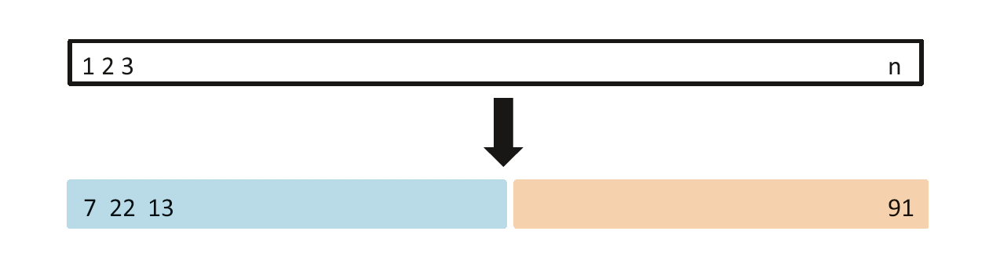
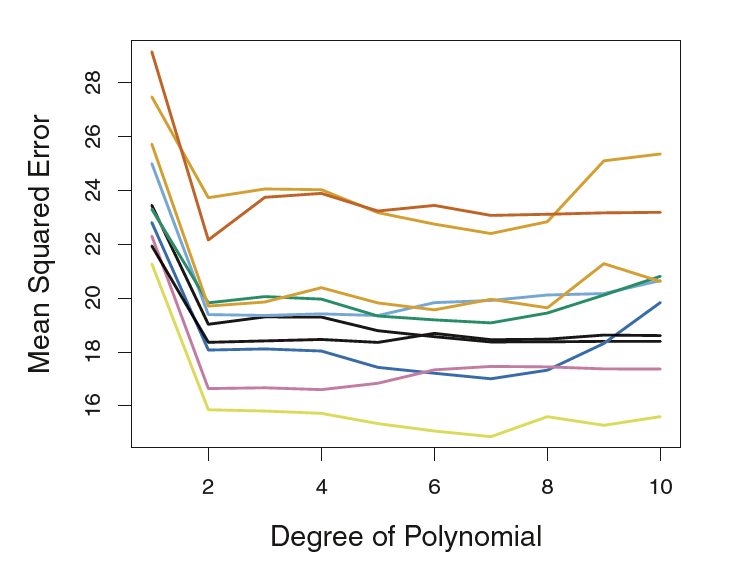
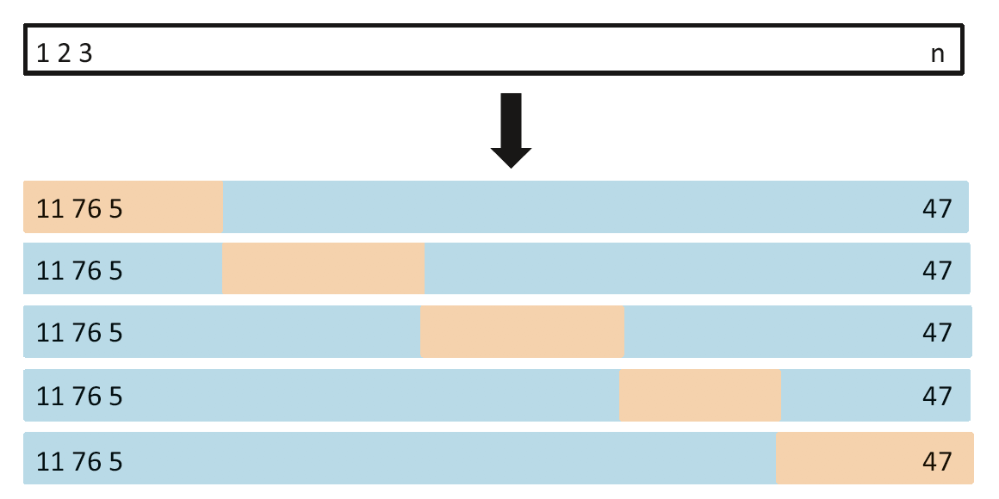

```{r setup, include=FALSE}
knitr::opts_chunk$set(echo = TRUE)
library(ggplot2)
library(ISLR)
```

This involves repeatedly drawing samples from a training set and refitting a model
of interest on each sample in order to obtain additional information about
the fitted model.


The most commonly used resampling techniques are

  1. _____________:  can be used to estimate the _______ associated with a given statistical learning method in order to evaluate its ________, or to select the appropriate level of _____________.
  
  2. _____________: used in several contexts, most commonly to provide a measure of ________ of a ______ ________ or of a given statistical learning method.

# Cross-Validation

Recall from Chapter 2:

  * Test Error: The test error is the average error that results from using
a statistical learning method to predict the response on a new observation—
that is, a measurement that was not used in training the method.

In the absence of a very large designated test set that can be used to directly estimate the test error rate, a number of techniques can be used to estimate this quantity using the available training data.

We consider ______ methods that estimate the
test error rate by __________________  from the
fitting process, and then applying the statistical learning method to those held out observations.

## The Validation Set Approach

  Step 1: Randomly dividing the available set of observations into two parts, a ______ set and a ______ set (or ______ set).
  
  Step 2: Fit the model using the ______ set
  
  Step 3: Then, use the fitted model to predict the
responses for the observations in the ______ set

  Step 4: Find the MSE
  

  
Above figure is a schematic display of the validation set approach. A set of $n$ observations are randomly split into a training set (shown in blue, containing
observations 7, 22, and 13, among others) and a validation set (shown in beige, and containing observation 91, among others). The statistical learning method is fit on the training set, and its performance is evaluated on the validation set.  


**Example 1:**
  
For this example we use the `Auto` data set where we have 392 observations. 


  1. split the 392 observations into two
sets, a training set containing 196 of the data points, and a validation set
containing the remaining 196 observations.

  2. Fit a simple linear regression model (degree one) to predict the `mpg` using `hoursepower` using the training set.
  
  3. Calculate the test MSE.
  
```{r}
library(ISLR)
set.seed(3581)

#1.  

train = sample.int(392, 196) # Training indices

trainSet <- Auto[train, ] # Training data set
#dim(trainSet)
testSet <- Auto[-train, ] # Test data set
#dim(testSet)

#2.

fit1 <- lm(mpg ~ horsepower, data = trainSet)
#fit1

#3.
testPredit <- predict(fit1, testSet) # yhat values

testMSE1 <- mean((testSet$mpg - testPredit)^2)
testMSE1
```


**Example 2:**
  
Now we fit several (nine) regression models with degrees 2 through 10 to predict the `mpg` using `hoursepower` using the same training set that we defined above. Find the test MSE for each nine models.


```{r include=FALSE}
# Second degree

fit2 <- lm(mpg ~ poly(horsepower, 2), data = trainSet)
#fit2 <- lm(mpg ~ horsepower + I(horsepower^2), data = trainSet)

testPredit <- predict(fit2, testSet) 

testMSE2 <- mean((testSet$mpg - testPredit)^2)
testMSE2


```


```{r include=FALSE}
fit3 <- lm(mpg ~ poly(horsepower, 3), data = trainSet)
testPredit <- predict(fit3, testSet) 

testMSE3 <- mean((testSet$mpg - testPredit)^2)
testMSE3

fit4 <- lm(mpg ~ poly(horsepower, 4), data = trainSet)
testPredit <- predict(fit4, testSet) 

testMSE4 <- mean((testSet$mpg - testPredit)^2)
testMSE4

fit5 <- lm(mpg ~ poly(horsepower, 5), data = trainSet)
testPredit <- predict(fit5, testSet) 

testMSE5 <- mean((testSet$mpg - testPredit)^2)
testMSE5

fit6 <- lm(mpg ~ poly(horsepower, 6), data = trainSet)
testPredit <- predict(fit6, testSet) 

testMSE6 <- mean((testSet$mpg - testPredit)^2)
testMSE6

fit7 <- lm(mpg ~ poly(horsepower, 7), data = trainSet)
testPredit <- predict(fit7, testSet) 

testMSE7 <- mean((testSet$mpg - testPredit)^2)
testMSE7

fit8 <- lm(mpg ~ poly(horsepower, 8), data = trainSet)
testPredit <- predict(fit8, testSet) 

testMSE8 <- mean((testSet$mpg - testPredit)^2)
testMSE8

fit9 <- lm(mpg ~ poly(horsepower, 9), data = trainSet)
testPredit <- predict(fit9, testSet) 

testMSE9 <- mean((testSet$mpg - testPredit)^2)
testMSE9

fit10 <- lm(mpg ~ poly(horsepower, 10), data = trainSet)
testPredit <- predict(fit10, testSet) 

testMSE10 <- mean((testSet$mpg - testPredit)^2)
testMSE10
```

**Example 3**

Create a plot of degree of the model vs. the test MSE as a visual aid

```{r echo=FALSE}
testMSE_vals <- c(testMSE1, testMSE2, testMSE3, testMSE4, testMSE5, testMSE6, testMSE7, testMSE8, testMSE9, testMSE10)

degree <- c(1,2,3,4,5,6,7,8,9,10)

MSEgraph <- data.frame(testMSE_vals, degree)

ggplot(data = MSEgraph, aes(x = degree, y = testMSE_vals)) + geom_point(color = "red") + geom_line() + theme_bw() + 
  labs(x = "Degree of the polynomial", y = "Test MSE")
```

  
Note: Validation set MSE for the ____ fit is considerably smaller than the ___ fit. 




In the graph above, the validation method was repeated ten times, each time using a different random split of the observations into a training set and a validation set. This illustrates the variability in the estimated test MSE that results from this approach.

**Disadvantages of the validation approach**:

  1. As seen in the graph above, the validation estimate
of the test error rate can be highly _______, depending on precisely which observations are included in the training set and which observations are included in the validation set.

  2. Validation set error rate may tend to ________ the test error rate.


## Leave One Out Cross Validation (LOOCV)

Step 1: Split the set of observations such that:

  * validation set has ____ observation, say ___
  * training set has the remaining ___ observations.
  
Step 2: Fit the model using the training set (___ observations)
  
  Step 3: Predict ___ for the excluded observation using its value $x_1$.

  Step 4: Calculate $MSE_1 =$
  
  Step 5: repeat the process for all $n$ observations.
  
  Step 6: Calculate 
  
  $$CV_{(n)} = $$
  


The figure above is a schematic display of LOOCV. A set of n data points is repeatedly
split into a training set (shown in blue) containing all but one observation,
and a validation set that contains only that observation (shown in beige). The test
error is then estimated by averaging the n resulting MSE’s. The first training set
contains all but observation 1, the second training set contains all but observation
2, and so forth.

**Example 3:**
  
For this example we use the `Auto` data set where we have 392 observations. Fit a simple linear regression model (degree one) to predict the `mpg` using `hoursepower`. Calculate the LOOCV Error.

***Note:** Here, we will perform linear
regression using the `glm()` function rather than the `lm()` function because the former can be used together with `cv.glm()` to get the LOOCV Error.*

```{r}
library(boot)
glm_fit <- glm(mpg~horsepower ,data=Auto)
cv_error <- cv.glm(Auto ,glm_fit)
#cv_error
loocv_error <- cv_error$delta[1]
loocv_error
```


**Example 4:**
  
Fit several (10) regression models with degrees 1 through 10 to predict the `mpg` using `horsepower` using the LOOCV approach. Find the LOOCV Errors for each 10 models. Which model would you use as your final model and why?

```{r include=FALSE}
loocv_err_vec <- rep (0,10) # This is where we will store the loocv values for the 10 models

for (i in 1:10){
 glm_fit <- glm(mpg~poly(horsepower ,i), data=Auto)
 loocv_err_vec[i] <- cv.glm(Auto , glm_fit)$delta [1]
}

loocv_err_vec
```

```{r echo=FALSE}
degree <- c(1,2,3,4,5,6,7,8,9,10)

LOOCVgraph <- data.frame(loocv_err_vec, degree)

ggplot(data = LOOCVgraph, aes(x = degree, y = loocv_err_vec)) + geom_point(color = "red") + geom_line() + theme_bw() + 
  labs(x = "Degree of the polynomial", y = "Test MSE")
```

**Advantages of the LOOCV approach**:  

  1. Less bias (training set has $n-1$ observations all the time)
  2. Does not overestimate the test error.
  3. The results are same all the time.
  
  
## k-Fold Cross-Validation

Step 1: Divide the set of observations into $k$ groups, or folds, of approximately equal size.

Step 2: The first fold is treated as a validation set

Step 3: Fit the model using remaining $k − 1$ folds.

Step 3: The mean squared error, $MSE_1$, is then computed on the observations in the held-out fold.

Step 4: This procedure is repeated $k$ times; each time, a different group of observations is treated as a validation set.

Step 5: This process results in k estimates of the test error,___, ___,....

Step 6: The $k$-fold CV estimate is computed by averaging
these values, 

$$CV_{(k)} = $$




Above figure is a schematic display of 5-fold CV. A set of n observations is randomly split into five non-overlapping groups. Each of these fifths acts as a validation set (shown in beige), and the remainder as a training set (shown in blue). The test error is estimated by averaging the five resulting MSE estimates.


**Note: **

  1. Usually perform $k$-fold CV using $k=$ or $k=$. 

  2. LOOCV is a special case in $k$-fold CV in which $k=$.
  
  3. Advantage: 
  

**Example 5:**

For this example we use the `Auto` data set where we have 392 observations. Fit a simple linear regression model (degree one) to predict the `mpg` using `hoursepower`. Calculate the 10-fold CV Error.

```{r include=FALSE}
library (boot)
glm_fit <- glm(mpg~horsepower ,data=Auto)
cv_error <- cv.glm(Auto ,glm_fit, K = 10)
#cv_error
k_fold_cv_error <- cv_error$delta[1]
k_fold_cv_error
```


        
**Example 6:**
  
Fit several (10) regression models with degrees 1 through 10 to predict the `mpg` using `horsepower` using the LOOCV approach. Find the 10-fold CV Errors for each 10 models. Which model would you use as your final model and why?

```{r include=FALSE}
cv_err_vec <- rep (0,10) # This is where we will store the loocv values for the 10 models

for (i in 1:10){
 glm_fit <- glm(mpg~poly(horsepower ,i), data=Auto)
 cv_err_vec[i] <- cv.glm(Auto , glm_fit, K = 10)$delta [1]
}

cv_err_vec

```

```{r echo=FALSE}
degree <- c(1,2,3,4,5,6,7,8,9,10)

kfold_CVgraph <- data.frame(cv_err_vec, degree)

ggplot(data = kfold_CVgraph, aes(x = degree, y = cv_err_vec)) + geom_point(color = "red") + geom_line() + theme_bw() + 
  labs(x = "Degree of the polynomial", y = "Test MSE")
```
  
  
### Bias-Variance Trade-Off for k-Fold Cross-Validation


| Method          | No. of obs used to fit the model | Bias? | Variance? | 
| ----------------|-------------------------|--------------|---------:|
| Validation approach | $_$ (usually) | overestimate the test error, so _____ | _____ |
| LOOCV   | $_$ | Unbiased | High compared to k-fold CV |
| k-fold CV | $_$ (each training set) | Somewhere in between | $k=5$ or $10$ gives low variance |


## The Bootstrap

Rather than repeatedly obtaining independent data sets from the population, we instead obtain distinct data sets by repeatedly sampling observations from the original data set with replacement. This process is known as the Bootstrap process.

This approach is illustrated in the following Figure on a simple data set;


**Note:** Bootstrap sample size is n, which is the size of the original sample as well. This is usually the case.

  > The Bootstrap Idea: The original sample approximates the population from which it was drawn. So resamples from this sample approximate what we would get if we took many samples from the population. The bootstrap distribution of a statistic, based on many resamples, approximates the sampling distribution of the statistic, based on many samples.
  
**Example 7:**

We will investigate samples taken from the CDC’s database of births. For the North Carolina data: `NCBirths2004`, we are interested in $\mu$, the true birth weight mean for all North Carolina babies born in 2004 (population mean).


1. What is the average birth wight of a NC baby in this sample (here we are looking for the sample mean)

```{r include=FALSE}
library(resampledata)
data(NCBirths2004)
head(NCBirths2004)

mean(NCBirths2004$Weight) # Investigate the sample mean of the Weight
```


2. Find the mean and the standard error of the bootstrap distribution of the mean birth wight of a NC babies

```{r include=FALSE}
# Let's start bootstrapping now!

BirthWeightSample <- NCBirths2004$Weight # This is my original SAMPLE 
n <- length(BirthWeightSample) # This is the original sample size

B <- 1000  # The number of bootstrap samples
boot_Mean_Wt <- numeric(B) # A vector to store bootstrap means from the bootstrap samples

for (i in 1:B){
  x <- sample(BirthWeightSample, size = n, replace = TRUE) # Here n is the size of your bootstrap sample
  boot_Mean_Wt[i] <- mean(x)
}

mean(boot_Mean_Wt) # This is the mean of the bootstrap means - so the center of the bootstrap distribution
sd(boot_Mean_Wt) # This is the standard error of the bootstrap distribution
```

3. Plot and comment about the bootstrap distribution of the mean 

```{r echo=FALSE}
# Now plot the bootstrap distribution

ggplot(data = data.frame(x = boot_Mean_Wt), aes(x = x)) + 
  geom_histogram(fill = "lightblue", color = "black") + 
  geom_vline(xintercept  = mean(boot_Mean_Wt), color = "red") +
  labs(x = substitute(paste(bar(X),"* (g)")), 
       title = "Bootstrap distribution of means for NC birth weights") + 
  theme_bw() 
```

**Note:** We use * to denote the bootstrap estimates. For example, $\bar{X}^{∗}_1$ would be the mean from the first bootstrap sample.
  
  
  
  

