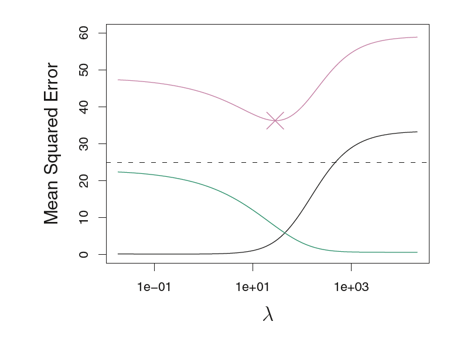
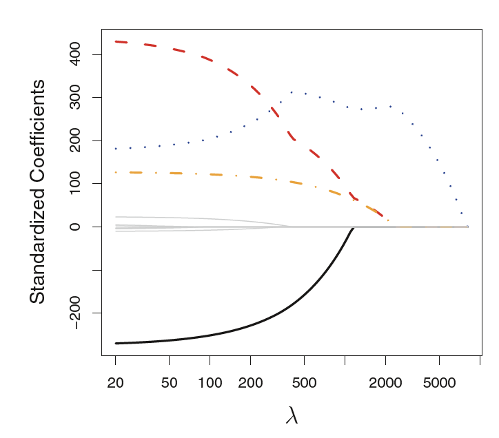

```{r setup, include=FALSE}
knitr::opts_chunk$set(echo = TRUE)
library(ggplot2)
library(ISLR)
```

\setcounter{section}{6}
\setcounter{subsection}{1}

**Recall:**

In the regression setting, the standard linear model

$$Y = \beta_0 + \beta_1X_1+\dots + \beta_pX_p + \epsilon$$

is commonly used to describe the relationship between a response $Y$ and
a set of variables $X_1,X_2, . . .,X_p$. We have seen in Chapter 3 that one
typically fits this model using ___________.


**Why might we want to use another fitting procedure instead of least squares?**

  1) ***To increase Prediction Accuracy:***
  
  * Provided that the true relationship between the response and the predictors is approximately linear, the least squares estimates will have ________.
  
  * If $n >> p$—that is, if $n$, the number of observations, is much larger than $p$, the number of variables—then the least squares estimates tend to also have ________, and hence will perform well on test observations.
  
  * However, if $n$ is not much larger than $p$, then there can be a lot of variability in the least squares fit, resulting in _________ and consequently poor _________ on future observations not used in model training.
  
  * if $p > n$, then there is no longer a unique least squares coefficient estimate: the variance is infinite so the method cannot be used at all.
  
  
  * By ________ or ________ the estimated coefficients, we can often substantially reduce the _________ at the cost of a negligible increase in ________. This can lead to substantial improvements in the accuracy with which we can predict the response for observations not used in model training.
  
  2) ***Model Interpretability:***
  
  * Including _______ variables leads to unnecessary complexity in the resulting model.
  
  * By _______ these variables—that is, by setting the corresponding coefficient estimates to zero—we can obtain a model that is more easily interpreted.
  

In this chapter, we see some approaches for automatically performing __________ (or ____________) that is,for excluding irrelevant variables from a multiple regression model.


**Alternative classes of methods:**

  1) Subset Selection
      * Best subset selection
      * Forward selection
      * Backward selection
      
      
  2) Shrinkage.
      * Lasso
      * Ridge
      
  3) Dimension Reduction.
      * PCR
      * PLS
  
# Subset Selection

## Best subset selection

  Step 0: Fit the model with 0 predictors (denoted as $\mathcal{M_0}$) - One model
  
  Step 1: Fit all models with 1 predictor - ____ models.
    * Find the best model using smallest RSS, or equivalently largest $R^2$. Denote this model as $\mathcal{M_1}$
    
  Step 2: Fit all models with 2 predictors - ____ models.
    * Find the best model using smallest RSS, or equivalently largest $R^2$. Denote this model as $\mathcal{M_2}$
    
    $\vdots$
    
  Step p: Fit all models with p predictors - ____ models.
    * Find the best model using smallest RSS, or equivalently largest $R^2$. Denote this model as $\mathcal{M_p}$
  
  Final Step: Select a single best model from among $\mathcal{M_0}, \mathcal{M_1}, \dots, \mathcal{M_p}$ using cross validated prediction error, $C_p$, (AIC), BIC, or adjusted $R^2$.
  
  **Note 1:**
  
  * Here we have created _____ models. Out of those models, we used ____ models to pick ___ final model.
      
  * Here, RSS ____ and $R^2$ ______ as the number of predictors _____ in the model.
      
  * Low RSS or a high $R^2$ indicates a model with low training error.
      
  * BUT, we need a model with low ____ error.
      
  * Therefore, we use criterion such as ross validated prediction error, $C_p$, (AIC), BIC, or adjusted $R^2$.
    
  
  **Pros**: Simple and conceptually appealing.
  
  **Cons**: Computationally infeasible for values of $p$ greater than
around 40 ($p=40$ $\implies$ $2^{40}$ models)


**Example 1**

Here we apply the best subset selection approach to the Hitters data. We
wish to predict a baseball player’s Salary on the basis of various statistics associated with performance in the previous year.

```{r include=FALSE}
library(ISLR)
data(Hitters)
names(Hitters)

dim(Hitters)

head(Hitters)
#View(Hitters) # only run this in the console, never run it here

Hitters <- na.omit(Hitters)
#dim(Hitters)


library (leaps)
regfit <- regsubsets(Salary~., data = Hitters)

summary(regfit)
```

By default, `regsubsets()` only reports results up to the best eight-variable model. But the nvmax option can be used
in order to return as many variables as are desired. Let's fit up to a
19-variable model.  

```{r include=FALSE}
regfit <- regsubsets (Salary~.,data=Hitters, nvmax =19)
reg_summary <- summary(regfit)
reg_summary # Print the summary output
```


There are more information in the `summary` than displayed above. Use the `names()` function to check out what's available

```{r include=FALSE}
names(reg_summary) 
```

Let's look at adjusted $R^2$ values for all 19 models selected so far.

```{r include=FALSE}
reg_summary$adjr2
```

How many and what variables are in the best model selected using the adjusted $R^2$ criterion?

<!--
11, 
-->
   
Let's create a plot to visualize the  change in adjusted $R^2$ criterion.

```{r echo=FALSE}
library(ggplot2)

data <- data.frame(adjR2 = reg_summary$adjr2, numVar = seq(1,19))

ggplot(data, aes(y = adjR2, x = numVar)) + geom_point(color = "Red") + geom_line() + theme_bw()

```

Which model has the max adjusted $R^2$?

```{r include=FALSE}
which.max(reg_summary$adjr2)
```

Now what we know how many and what variables to include in the model, we are ready to fit our final model using the adjusted $R^2$ criterion.

```{r include=FALSE}
coef(regfit, 11)
```

**Example 2:**

In a similar fashion we can use the $C_p$ criterion, and indicate the models with the _______ value using `which.min()`.

Now, let's look at  $Cp$ values for all 19 models.

```{r include=FALSE}
reg_summary$cp
```

How many and what variables are in the best model selected using the  $Cp$ criterion?

<!--
10, 
-->
   
Let's create a plot to visualize the  change in $Cp$ criterion.

```{r echo=FALSE}
library(ggplot2)

data <- data.frame(CP = reg_summary$cp, numVar = seq(1,19))

ggplot(data, aes(y = CP, x = numVar)) + geom_point(color = "Blue") + geom_line() + theme_bw()

```

Which model has the min $Cp$?

```{r include=FALSE}
which.min(reg_summary$cp)
```

Now what we know how many and what variables to include in the model, we are ready to fit our final model using the $Cp$ criterion.

```{r include=FALSE}
coef(regfit, 10)
```

**Example 3:**

In a similar fashion we can use the $BIC$ criterion, and indicate the models with the _______ value using `which.min()`. Continue and find the best model using the $BIC$ criterion.


## Forward Selection


  Step 0: Fit the model with 0 predictors (denoted as $\mathcal{M_0}$) 
  
  Step 1: Find the best model only adding one predictor to the previous model. Use RSS, or  $R^2$ to pick the best. Denote this model as $\mathcal{M_1}$
    
  Step 2: Find the best model only adding one predictor to the previous model. Use RSS, or  $R^2$ to pick the best. Denote this model as $\mathcal{M_2}$
    
    $\vdots$
    
  Step p: Find the best model only adding one predictor to the previous model. Use RSS, or  $R^2$ to pick the best. Denote this model as $\mathcal{M_p}$
  
  Final Step: Select a single best model from among $\mathcal{M_0}, \mathcal{M_1}, \dots, \mathcal{M_p}$ using cross validated prediction error, $C_p$, (AIC), BIC, or adjusted $R^2$.


  **Note 2:**
  
  * Here we have created $1+\frac{p(p+1)}{2}$ models. 
  
  **Pros**
  
  * Computational efficiency over the best subset selection

  **Cons**
  
  * Forward selection can be applied even in the high-dimensional
setting where $n < p$; however, in this case, it is possible to construct submodels $\mathcal{M_0}, \mathcal{M_1}, \dots, \mathcal{M_{n-1}}$ only, since each submodel is fit using least squares, which will not yield a unique solution if $p \geq n$.

**Example 4:**

Here we apply the Forward Selection approach to the Hitters data. We
wish to predict a baseball player’s Salary on the basis of various statistics associated with performance in the previous year.

We can use the `regsubsets()` function to perform forward selection, using the argument `method="forward"`.

```{r include=FALSE}
library(ISLR)
data(Hitters)
names(Hitters)

dim(Hitters)

head(Hitters)
# View(Hitters) # only run this in the console, never run it here

Hitters <- na.omit(Hitters)
dim(Hitters)

library (leaps)
regfit_fwd <- regsubsets (Salary~.,data=Hitters , nvmax =19, method ="forward")
fwd_summary <- summary(regfit_fwd)
fwd_summary
```


  i) What is the predictor variable selected for the the best *one-variable
model*?

  ii) What are the predictor variables selected for the the best *two-variable
model*?

  iii) How many and what variables are in the best model selected using the  $Cp$ criterion?
  
```{r include=FALSE}
fwd_summary$cp
which.min(fwd_summary$cp)
```
  
  iv) Create a plot to visualize the  change in $Cp$ criterion.

```{r echo=FALSE}
library(ggplot2)

data <- data.frame(CP = fwd_summary$cp, numVar = seq(1,19))

ggplot(data, aes(y = CP, x = numVar)) + geom_point(color = "Blue") + geom_line() + theme_bw()

```


## Backward Selection (Backward Elimination)


  Step 0: Fit the model with all $p$ predictors (denoted as $\mathcal{M_p}$, the full model) 
  
  Step 1: Find the best model only removing one predictor from the previous model. Use RSS, or  $R^2$ to pick the best. Denote this model as $\mathcal{M_{p-1}}$
    
  Step 2: Find the best model only removing one predictor from the previous model. Use RSS, or  $R^2$ to pick the best. Denote this model as $\mathcal{M_{p-2}}$
    
    $\vdots$
    
  Step p: Find the best model only removing one predictor from the previous model. Use RSS, or  $R^2$ to pick the best. Denote this model as $\mathcal{M_{0}}$
  
  Final Step: Select a single best model from among $\mathcal{M_0}, \mathcal{M_1}, \dots, \mathcal{M_p}$ using cross validated prediction error, $C_p$, (AIC), BIC, or adjusted $R^2$.


  **Note 2:**
  
  * Here we have created $1+\frac{p(p+1)}{2}$ models. 
  
  **Pros**
  
  * Computational efficiency over the best subset selection

  **Cons**
  
  * Strictly need $n>p$ to use backward elimination

**Example 5**

Here we apply the backward elimination approach to the Hitters data. We
wish to predict a baseball player’s Salary on the basis of various statistics associated with performance in the previous year.

We can use the `regsubsets()` function to perform forward selection, using the argument `method="backward"`.

```{r include=FALSE}
library(ISLR)
data(Hitters)
names(Hitters)

dim(Hitters)

head(Hitters)
# View(Hitters) # only run this in the console, never run it here

Hitters <- na.omit(Hitters)
dim(Hitters)

library (leaps)
regfit_bwd <- regsubsets (Salary~.,data=Hitters , nvmax =19, method ="backward")
bwd_summary <- summary(regfit_bwd)
bwd_summary
```


  i) What is the predictor variable selected for the the best *one-variable
model*?

  ii) What are the predictor variables selected for the the best *two-variable
model*?

  iii) How many and what variables are in the best model selected using the  $Cp$ criterion?
  
```{r include=FALSE}
bwd_summary$cp
which.min(bwd_summary$cp)
```
  
  iv) Create a plot to visualize the  change in $Cp$ criterion.

```{r echo=FALSE}
library(ggplot2)

data <- data.frame(CP = bwd_summary$cp, numVar = seq(1,19))

ggplot(data, aes(y = CP, x = numVar)) + geom_point(color = "Blue") + geom_line() + theme_bw()
```

 v) Now that we know how many and what variables to include in the model, we are ready to fit our final model using the $BIC$ criterion.


## Choosing the optimal model

1) Directly estimate test error, using validation set approach or cross validation approach.

2) Estimate test error by making an adjustment to the training error to account for the Bias due to overfitting.

  i) The $C_p$ criterion
  
  $$C_p = \frac{1}{n}(RSS + 2d\hat{\sigma}^2)$$
  
  Where $\hat{\sigma}^2$ estimates the variance of the error $\epsilon$, $d$ is the number of predictors in the LS model.
  
  Here $2d\hat{\sigma}^2$ adjust the fact that training tends to underestimate the test error.
  
  The $C_p$ statistic tends to take on a small value for models with a low test  error, so when determining which of a set of models is best, we choose the model with the ________ $C_p$ value.
  
  
  ii) The AIC criterion
  
  $$AIC = \frac{1}{n\hat{\sigma}^2}(RSS + 2d\hat{\sigma}^2)$$
  $C_p$ and AIC are proportional to each other, and so only  $C_p$  is mostly used.
  
  iii) The BIC criterion


  $$BIC = \frac{1}{n\hat{\sigma}^2}(RSS + log(n)d\hat{\sigma}^2)$$
  Like $C_p$, the BIC will tend to take on a small value for a model with a
low test error, and so generally we select the model that has the lowest
BIC value.


  iv) Adjusted $R^2$ 


  $$\text{Adjusted } R^2 = 1- \frac{RSS/(n-d-1)}{TSS/(n-1)}$$

  Unlike $C_p$, AIC, and BIC, for which a small value indicates a model with
a low test error, a ________ value of adjusted $R^2$ indicates a model with a
small test error.


# Shrinkage Methods

The subset selection methods described in Section 1 involve using least
squares to fit a linear model that contains a subset of the predictors. As an
alternative, we can fit a model containing all $p$ predictors using a technique
that constrains or regularizes the coefficient estimates, or equivalently, that
shrinks the coefficient estimates towards zero.

It may not be immediately obvious why such a constraint should improve the fit, but it turns out that shrinking the coefficient estimates can significantly reduce their variance. The two best-known techniques for shrinking the regression coefficients towards zero are _______ regression and the ______.

## Ridge Regression

Recall from Chapter 3 that the least squares fitting procedure estimates
$\beta_1, \beta_2,\dots \beta_p,$ using the values that minimize

$$RSS = \sum_{i=1}^n(y_i-\beta_0 - \sum_{j=1}^p\beta_jx_{ij})^2$$
Ridge regression is very similar to least squares, except that the coefficients are estimated by minimizing a slightly different quantity:

$$RSS + \lambda\sum_{j=1}^p\beta_j^2$$
  
  * $\lambda$ - 
  * $\lambda\sum_{j=1}^p\beta_j^2$ - 
  
  (this quantity is small when $\beta_j$s are small)
  
  * When $\lambda = 0$ - 
  * When $\lambda \rightarrow \infty$ 

**Note:  **

  * Need to standardize predictors before using Ridge regression
  * For each $\lambda$ value we choose, ridge regression will produce a different set of coefficient estimates.
  * Our goal is to find the best $\lambda$ value using CV
  
  
  
  * As  $\lambda$ increases flexibility of the ridge model decreases. This will lead to decreased variance but increased bias.

**Example 6**

**Note: **

We will use the `glmnet` package in order to perform ridge regression and the lasso. The main function in this package is `glmnet()`, which can be used to fit ridge regression models.

This function has slightly different syntax from other model-fitting functions that we have encountered thus far in this book. In particular, we must pass in an $x$
matrix as well as a $y$ vector, and we *do not* use the $y \sim x$ syntax.

Perform ridge regression in order to predict `Salary` on
the `Hitters` data.

First we use `model.matrix()` function. Which is particularly useful for creating $x$; not only does it produce a matrix corresponding to the 19 predictors but it also automatically transforms any qualitative variables into dummy variables.

```{r include=FALSE}
x <- model.matrix (Salary~.,Hitters )[,-1] # remove y
y <- Hitters$Salary
#x
#y
```

The `glmnet()` function has an alpha argument that determines what type of model is fit. If `alpha=0` then a ridge regression model is fit

By default the `glmnet()` function performs ridge regression for an automatically selected range of $\lambda$ values. However, here we have chosen to implement the function over a grid of values ranging from $\lambda = 10^{10}$ to $\lambda = 10^{-2}$

```{r include=FALSE}
set.seed (1)
library (glmnet )
grid <- 10^seq(10, -2, length = 100)
ridge_model <- glmnet(x, y, alpha = 0, lambda = grid)
```

In general, we use cross-validation to choose the tuning parameter $\lambda$. We can do this using the built-in cross-validation function, `cv.glmnet()`.

```{r include=FALSE}
train <- sample(1: nrow(x), nrow(x)/2)
test <- (-train)
y_test <- y[test]

cv_out <- cv.glmnet(x[train, ], y[train], alpha =0, lambda = grid)

plot(cv_out)

bestlam <- cv_out$lambda.min
bestlam

predict(ridge_model, type ="coefficients", s = bestlam )[1:20, ]
```

What is the test MSE associated with this value of chosen $\lambda$?

```{r include=FALSE}
ridge_pred <- predict (ridge_model ,s = bestlam, newx = x[test, ])
mean((ridge_pred - y_test)^2)
```


## Lasso 

**Disadvantage of Ridge:** Unlike best subset,
forward, and backward  elimination, which will generally select models that involve just a subset of the variables, ridge regression will include all $p$ predictors in the final model.

The penalty $\lambda\sum_{j=1}^p\beta_j^2$ will shrink all of the coefficients towards zero, but it will not set any of them
exactly to zero (unless $\lambda = \infty$ ).


The lasso is a relatively recent alternative to ridge regression that overcomes this disadvantage. The lasso coefficients, minimize the quantity:

$$RSS + \lambda\sum_{j=1}^p|\beta_j|$$

  
  * When $\lambda = 0$ - 
  * When $\lambda$ is large some coefficient will be exactly equal to zero.
  * Lasso give ____ models -  models only has subset of variables.

**Note:  **

  *  Need to standardize predictors before using Lasso
  * For each $\lambda$ value we choose, Lasso will produce a different set of coefficient estimates.
  * Our goal is to find the best $\lambda$ value using CV
  
  
  * Finally fit the model using all of the available observations and selected valu of $\lambda$


**Example 7:**

Perform Lasso in order to predict `Salary` on
the `Hitters` data.

Just like in the ridge case we first we use `model.matrix()` function. Which is particularly useful for creating $x$; not only does it produce a matrix corresponding to the 19 predictors but it also automatically transforms any qualitative variables into dummy variables.

```{r include=FALSE}
x <- model.matrix (Salary~.,Hitters )[,-1] # remove y
y <- Hitters$Salary
#x
#y
```

The `glmnet()` function has an alpha argument that determines what type of model is fit. If `alpha=1` then a lasso model is fit

By default the `glmnet()` function performs lasso for an automatically selected range of $\lambda$ values. However, here we have chosen to implement the function over a grid of values ranging from $\lambda = 10^{10}$ to $\lambda = 10^{-2}$

```{r include=FALSE}
set.seed (1)
library (glmnet)
grid <- 10^seq(10, -2, length = 100)
lasso_model <- glmnet(x, y, alpha = 1, lambda = grid)
```

In general, we use cross-validation to choose the tuning parameter $\lambda$. We can do this using the built-in cross-validation function, `cv.glmnet()`.

```{r include=FALSE}
train <- sample(1: nrow(x), nrow(x)/2)
test <- (-train)
y_test <- y[test]

cv_out_lasso <- cv.glmnet(x[train, ], y[train], alpha = 1, lambda = grid)

plot(cv_out_lasso)

bestlam <- cv_out_lasso$lambda.min
bestlam

predict(lasso_model, type ="coefficients", s = bestlam )[1:20, ]
```


